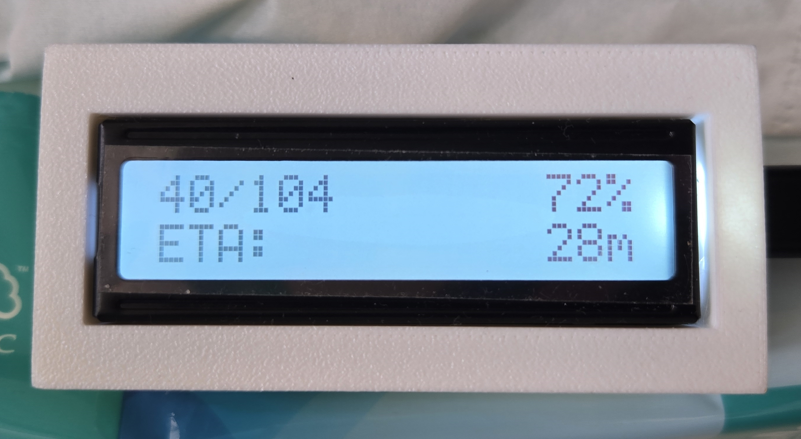

## ESP32 + LCD1602 Bambu Lab 3D Printer Progress Meter

Micropython program for showing printing progress of Bambu Lab A1 mini 3D Printer on ESP32 + 1602 LCD over local MQTT connection.  
Requires [umqtt.simple](https://github.com/micropython/micropython-lib/blob/master/micropython/umqtt.simple/umqtt/simple.py) (imported as umqtt**s**.simple) and [micropython-i2c-lcd](https://github.com/brainelectronics/micropython-i2c-lcd).
## Features
1. Displays print progress and estimated print time (data retrived from the printer).
2. Displays message when print is done.
3. Displays printer error codes (no interpretation at the moment).
## Hardware Required
1. ESP32 microcontroller (or other microcontrollers with micropython and WiFi support) with micropython installed
2. LCD1602 I2C display connect to the ESP32
3. Case (optional)
## Installation
1. Download and extract boot.py, main.py and config_template.py to a folder.
2. Download [umqtt.simple](https://github.com/micropython/micropython-lib/blob/master/micropython/umqtt.simple/umqtt/simple.py) and [micropython-i2c-lcd](https://github.com/brainelectronics/micropython-i2c-lcd/releases).
3. Put *simple.py* from umqtt.simple to *yourprojectfolder/lib/umqtts*, extract folder *lcd_i2c* to *lib*.
4. Copy *config_template.py* as a new file *config.py*.
5. Edit *config.py* as instructed in the file.
6. Inject the content of the project folder into the ESP32.
## Note
1. Does not require LAN Only mode to be on.
2. Has not been tested with other Bambu Lab printers.
3. Feel free to copy and improve upon this program👍.